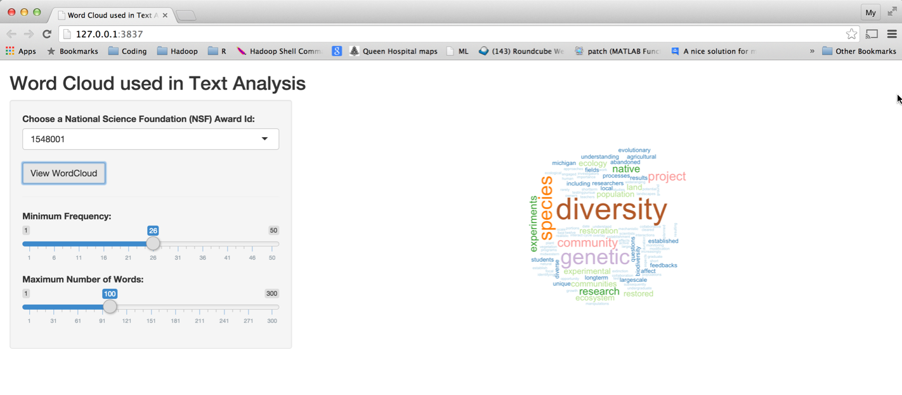
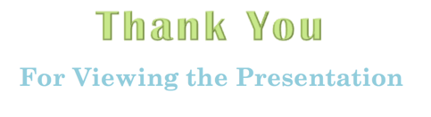

Word Cloud Used in Text Analysis
========================================================
author: My D. Coyne
date: Sat Jul 25 14:00:59 2015

Motivation
========================================================

Term Document Matrix (TDM) is often use for exploratory text analysis.  TDM is a matrix presents the frequency of words in a document.  

<span style="color:red">**Problem Statement**  TDM is not intuitive in spotting out the highest frequent term.  Is there a better presentation of the TDM than a tabular of numbers (for requency of words)?</span>

What is Word Cloud?  Why use it?
====

- **Word Cloud:** is a graphical representation of the TDM, in which the larger the word in the visual, the more common the word is in the document.  

- **Benefits:**
  - *Add clarity* The visual presentation can identify trends or patterns that may not easy to see in a tabular matrix
  
  - *Effective communicating tool*  Communicating the most salient points or themes in a reporting document that is easy to understand, yet impactful.

Approach
========================================================

- <span style="color:pink">Using R Text Mining, tm package</span> to perform the basic text mining steps; they are:
    - convert all words to lower cases
    - remove punctuation marks
    - remove numbers
    - remove stop words in English (Ref. 1)
    - form a Term Document Matrix (TDM) of word frequency
- <span style="color:pink">Using R WordCloud package</span> to plot the TDM
- <span style="color:pink">Using R Shiny package</span> to implement the web application
- <span style="color:pink">Data:</span> 
    - Award grants by National Science Foundataion (NSF) on public domain (Ref. 2)
    - Obtain only text of the abstract, save the text to file.  Each award abstract is in a file
    - At run time read-in only file name to serve as choice on a drop down list for users to choose from.
    
Application Structure
===
<span style="color:green">ui</span> *displays* of some simple UI widgets drop down list with choices to select; sliders to control the threshold for frequency of words and number of words in a select document, and a button to view the word cloud.  <span style="color:red">Tool tip, mouse over the heading of each UI widget,</span> is used to provide guide through the UI. 

<span style="color:green">server</span> *orchestrates* the calculation of Term Document Matrix (TDM), and plotting of the resulting word cloud

<span style="color:green">global</span> *analyzes* text to form the TDM (using R Text Mining package)

**Note** A limitation of RMarkdown is that it does not call global.R, [[reference found here]] (https://github.com/rstudio/rmarkdown/issues/211).  Alhough my application works,  I cannot embedded the application in RStudio Presenter as stated in requirement #4.  
 


server.R (code example)
========================================================

```r
library('shiny')
shinyApp(
  server = function(input, output, session) {
  # Define a reactive expression for the document term matrix
  terms <- reactive({
    # Change when the "update" button is pressed...
    input$update
    # ...but not for anything else
    isolate({
      withProgress({
        setProgress(message = "Processing corpus...")
        getTermMatrix(input$selection)
      })
    })
  })
  
  # Make the wordcloud drawing predictable during a session
  wordcloud_rep <- repeatable(wordcloud)
  
  output$plot <- renderPlot({
    v <- terms()
    wordcloud_rep(names(v), v, scale=c(4,0.2),
                  min.freq = input$freq, max.words=input$max,
                  colors=brewer.pal(12, "Paired"))
  })
},
)
```

<!--html_preserve--><iframe src="appf5e1c9389535b3ff8ae4f264b776ac5a/?w=&amp;__subapp__=1" width="100%" height="400" class="shiny-frame"></iframe><!--/html_preserve-->

Result
=========




References
========================================================
1.  Ref.  1.  SMART Stop words: [here] (http://jmlr.csail.mit.edu/papers/volume5/lewis04a/a11-smart-stop-list/english.stop)

2. Ref. 2. National Science Founcation awards on public domain [here] (https://www.nsf.gov/awards/about.jsp).  Scroll down  and click on  [Recent Awards] (https://www.fastlane.nsf.gov/servlet/A6RecentWeeks)





